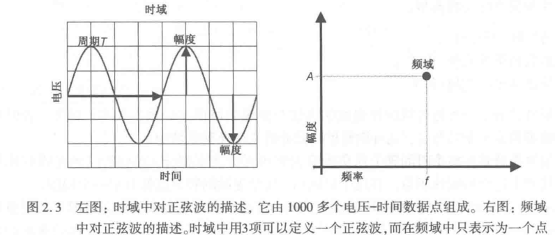
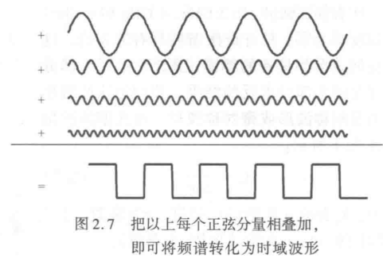
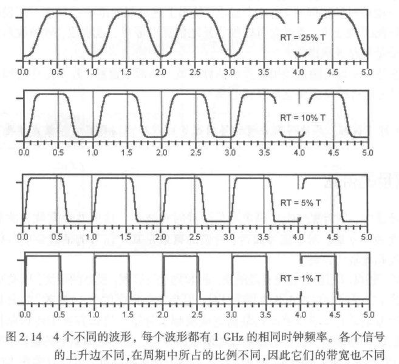
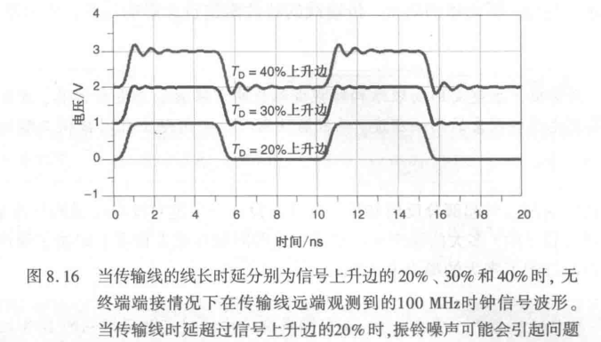
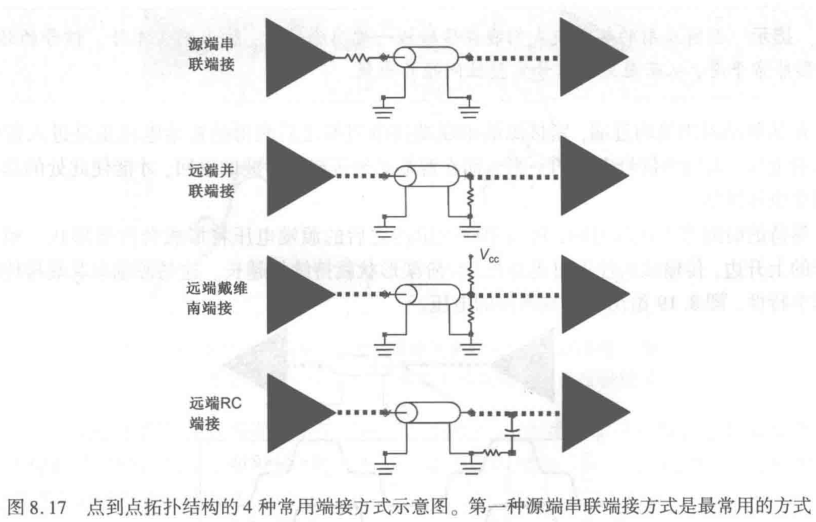

# 《信号完整性与电源完整性》

## 第1章 信号完整性分析概论

1. 信号完整性问题关心的是用什么样的物理互连线才能确保芯片输出信号的原始质量
2. 信号完整性问题一般分为6种：
   1. 单一网络的信号质量
   2. 损耗引起上升边退化
   3. 相邻网络之间的串扰
   4. 地弹和电源弹
   5. 轨道塌陷
   6. 电磁干扰
3. 随着上升沿的减小或时钟频率的提高，各种信号完整性问题变得更严重，并且更难以解决
4. 由于晶体管越来越小，它们的上升边越来越短，信号完整性已称为越来越大的问题，这是不可避免的
5. 为了发现、修正和防止信号完整性问题，必须将物理设计转化为等效的电路模型，并用这个模型仿真出波形，以便在制造产品之间预估其性能
6. 可以使用三种级别的分析来计算电器影响：经验法则，解析近似和数值仿真，这些分析可以应用于建模和仿真
7. 测量无源元件和互连线的电器特性的仪器一般有3种：阻抗分析仪、网络分析仪和时域反射计
8. 这些仪器对减小设计风险、提高建模和仿真过程精确度的可信度起着重要作用
9. 理解这6种信号完整性问题可以得出消除这些问题的最重要的方法
   1. ==**信号质量：所设计互连线的阻抗要可控，瞬时阻抗要恒定，线的两端要端接，要尽量按点到点拓扑去布线**==
   2. ==**损耗引起上升边退化：采用短互连线，宽线条和低损耗因子叠层板，以尽量降低与频率相关的损耗**==
   3. ==**串扰：保持线间距大于最小值**==
   4. ==**地弹和电源弹：不要弄坏返回路径，不要共享返回电流，尽量减小非理想返回路径之间的互感**==
   5. ==**轨道塌陷：使电源/地路径的阻抗和$\Delta I$噪声最小**==
   6. ==**电磁干扰：使带宽和地阻抗最小，尽量减小外电缆和屏蔽线上的共模电流，采取屏蔽措施**==

## 第2章 时域和频域

时域比较熟悉，但是频域特有的洞悉力则有助于理解和掌握许多信号完整性效应，如阻抗、有损线、电源分配网络、测量及模型

1. 时域是真实的世界，是唯一存在的域

2. 10ns——100MHz

3. 频域不是真实的，而是一个数学构造，是一个遵循特定规则的数学世界

4. 频域中不可能产生新的信息，同一波形的时域或频域所包含的信息完全相同

5. 带宽是频域的一个概念，我们用它描述与信号、测量、模型或互连相关的最高有效正弦波频率分量

6. 正弦波是频域中唯一存在的波形：可以用三个量充分刻画它的一切特性：频率，幅度，相位

7. 

8. 正弦波的组合不会产生平均值不为零的信号，为了描述直流值不为零的信号，需要明确地添加直流或偏移量（0Hz)

9. 在时域中可能要用上千个电压-时间数据点表示波形，在频域中则变换为一个幅度-频率数据点

10. 对于若干个频率点，其幅值的集合称为频谱，每个时域波形的频谱都有其独特的模式，计算时域波形频谱的唯一方法就是傅里叶变换

11. 有如下3种傅里叶变换：

    - 傅里叶积分：在整个时间轴上从负无穷到正无穷大求积分，得到的结果是零频率到正无穷大频率上连续的频域函数，每个连续的频率点都对应一个幅值

    - 离散傅里叶变换：实际使用

    - 快速傅里叶变换：与离散傅里叶完全一致，这种快速的算法只应用于时域中的数据点个数是2的整数次幂的情况

12. 对测量得到的任意波形，都能使用离散傅里叶变换，关键条件是用于实际波形从时域变换到频域的，对测量得到的任意波形，都能使用离散傅里叶比变换，关键条件是该波形应是重复性的，通常用大写字母F表示时域波形的重复频率
13. 频域逆变换到时域：傅里叶逆变换

14. 带宽用于表示频谱中最高的有效正弦波频率分量值，为了充分近似刻画时域波形的特征，这是需要包含的最高正弦波频率。带宽的选择对时域波形的最短上升边有直接的影响 
15. 在设计射频产品的互连线时，重要的是要求在一个相对较窄的带宽内受控。在设计高速数字产品的互连线时，重要的时要求其阻抗在一个很宽的带宽内受控，这通常很难做到
16. 频谱中最高的有效正弦波频率分量与时域中相应的上升边之间的相互关系是一个非常重要的特征
17. 通过对梯形波频谱的考察就可以得出结论：高于5次谐波分量的幅值只相当于理想方波中电压总量的很小一部分。因此，它们对上升边的影响也是微乎其微的
18. 除了基于上升沿去近似波形的带宽，其他计算基本上基本上都不能用手工完成。任意波形的傅里叶变换只能由数值仿真加以实现
19. 电磁干扰由电流中每个频率分量辐射引起。最严重的辐射源时共模电流，其总辐射将随着频率而线性增加
20. 电路中的振铃可能会使高频分量的幅度增大，并使辐射的强度增大10倍，这就是为了减小电磁干扰，通常要从解决信号完整性问题入手的一个原因
21. 带宽与信号的上升边直接相关，对于两个不同的波形，即使有相同的时钟频率，上升边和带宽也很可能不同，所以，只知道时钟的基频并不能得知带宽
22. 

23. 经验公式：带宽是时钟频率的5倍
24. 互连的带宽是指能被互连传输且未造成有效损耗的最高正弦波频率分量
25. 互连的带宽既可以在时域中测量，也可以在频域中测量，一般而言，如果源阻抗与传输线的特性阻抗不相等，则会发生复杂的多次反射

小结：

1. 数字信号的上升沿时间通常是指终值的10%-90%
2. 正弦波是频域中唯一存在的波形
3. 傅里叶变换是将时域波形变换成由许多个正弦波频率分量组成的频谱

## 第3章 阻抗与电气模型

1. 高速数字系统中，信号是指变化的电压或变化的电流，所有信号完整性的问题都是由模拟信号与互连电气特性之间的相互作用引起的，而**影响信号的关键电气特性是互连阻抗**

2. 阻抗定义为电压和电流之比：$Z=V/I$，这个定义始终都是正确的。**电压电流和互连阻抗这3个基本参量的相互作用，决定了所有的信号完整性效应**

3. 以下基本信号完整性问题都可以用阻抗加以描述：

   1. **任何阻抗突变都会引起电压信号的反射和失真**，这会使信号质量出现问题，如果信号感受到的阻抗保持不变，就不会发生反射，也不会发生失真。
   2. **信号的串扰是由两条相邻信号线（包括返回路径）之间电场和磁场耦合引起的**，信号线之间的互耦电容和互藕电感形成的阻抗决定了耦合电流和耦合电压的值
   3. 如果信号线之间的互感较高，就会产生地弹，当信号线之间互容增加或者返回路径有损坏时，互感将显著增加
   4. 最大的电磁干扰根源是流经外部电缆的共模电流，此电流由地平面上的电压引起

4. 阻抗是连接物理设计和电气性能的桥梁，我们的策略就是将期望的系统性能转化成需要的阻抗，并将物理设计转换成阻抗的特性

5. **阻抗是解决信号完整性问题方法学的核心**。为了把物理系统设计成我们希望的最佳性能，就需要把所设计的物理结构转化为与之等效的电路模型——建模！

6. 时域中理想的电阻器的阻抗是恒定的，并且与电压和电流无关，电阻器的阻抗确实很简单

7. 在时域中，可以计算出理想电容器的阻抗：
   $$
   Z=\frac{V}{I}=\frac{V}{C\frac{dV}{dI}}
   $$
   V表示电容器两端的电压，C表示电容器的电容值，I表示流过电容器的电流

   这是一个复杂的表达式，它表明，电容器的阻抗与电压波形的斜率（变化率）成反比

8. 再次强调，频域的重要特性就是正弦波是其中唯一存在的波形

9. **任何电路元件的阻抗由两个数组成：在每个频率点上的幅值和相位，阻抗的幅值和相位都与频率有关，它们都可能随频率变化而变化。所以在描述阻抗时，需要指出它是在哪个频率下的阻抗**

10. 在频域中仅需处理正弦电压和正弦电流，运用这个新观点，可以从另一角度来分析阻抗

11. 10nF的实际去耦电容，在1KHz频率时的阻抗时多大呢？首先，假定这个电容器是理想的电容器，10nF理想电容器的阻抗是$1/(2\pi *1KHz*10nF)≈16KΩ$，当然频率越低阻抗越大，例如在1Hz时，它的阻抗约为16MΩ

12. 电容电感的阻抗在频域中的表达式：
    $$
    Z_C=\frac{-i}{wC}\ \ \ \ \ \ \ \ 
    Z_L=iwL
    $$
    在频域中，电容器和电感器的阻抗形式都很简单，并且很容易描述，这是频域的优点之一

13. 我们所画的电路元件都是理想的电路元件，只能用理想电路元件的组合去逼近真实互连的实际性能

14. **电路理论**：用一套严格定义又相对直接的公式描述理想电路元件组合的阻抗

15. SPICE-simulation program with integrated circuit emphasis：集成电路仿真程序

16. SPICE是使用最普遍的一种工具，它在计算和绘制任意电路的阻抗方面近乎是万能的

17. 对于各种电压和电流波形，只要是用RLC和T（传输线）元件画出的电路就能用SPICE仿真

## 第7章 传输线的物理基础

1. 简单来说，传输线是由**两条**有一定长度的导线组成的，一条称为信号路径，另一条称为返回路径
2. 传输线有两个非常重要的特征：**特性阻抗和时延**
3. 信号路径和返回路径要电感最小化，这就意味着信号的返回路径会尽量靠近信号路径分布（可以减小环路面积，降低对外部干扰的敏感性）
4. **信号总是指信号路径和返回路径之间相邻两点的电压差**
5. 如果知道信号受到的阻抗，根据电压大小就能计算出电流，从这个意义上讲，信号可以被定义成电压或电流
6. **均匀传输线**也称为**可控阻抗传输线**。比如双绞线，微带线，带状线和共面线
7. **在信号完整性的优化设计中，其中一个设计目标是，将所有互连线都设计成均匀传输线，并减小所有非均匀传输线的长度**
8. 一般而言，绝大多数传输线，无论是平衡的还是非平衡的，它们对信号的质量和串扰效应都不会造成什么影响，但是返回路径将严重影响地弹和电电磁干扰问题
9. 低电阻并不意味着信号的速度越快
10. 不是电子本身的运动速度，而是电场所主导电子之间相互扭结的速度，决定着信号传播的快慢
11. **决定信号传播的速度：导线周围的材料，信号在传输线导体周围空间形成交变电场和磁场的建立速度和传播速度，决定了信号的传播速度**
12. 当电力线穿过不同的介质材料，如微带线时，有些电力线在材料中，有些电力线则在上面的空气中，这样影响信号速度的有效介电常数由两种材料共同决定
13. 信号在导线上传播的事实表明，信号路径与返回路径之间的电容在不停地充电
14. 信号在每一步所感受到的阻抗称为瞬时阻抗，如果互连阻抗是均匀一致的，那么每一步的瞬时阻抗都是相同的，均匀传输线称为阻抗受控传输线，这是因为在导线的任何位置其瞬时阻抗都是相同的
15. 减小反射的主要方法就是保持导线的几何结构不变，从而使信号受到的瞬时阻抗保持不变，这就是可控阻抗互连或保持沿线的瞬时阻抗不变的意义
16. 实际上，制约信号速度的部分原因就是信号路径和返回回路之间的串联回路电感
17. 传播时延与单位长度电容和单位长度电感直接相关
18. **反应均匀传输线的恒定瞬时阻抗，称为传输线的特性阻抗**
19. 仅仅说阻抗是非常模糊的，应该更加具体一点，**瞬时阻抗、特性阻抗、输入阻抗**
20. 高速数字系统中的所有互连都是传输线，传输线的特性将主导信号完整性效应
21. **所有的电流，无一例外，都必须构成回路**
22. 使用零阶模型，将传输线描述为一连串的小电容器，电流经过返回路径流回源端，这仅与瞬时环境和信号前言所在的那一小段传输线有关
23. 在信号路径和返回路径之间流动的是**位移电流**
24. 任何妨碍返回电流靠经信号电流的因素，例如返回路径上有一个间隙，都会增加回路电感，并增加信号受到的瞬时阻抗，这将引起信号的失真
25. 减小相邻平面之间阻抗的最重要方法就是尽量减小平面之间介质的厚度，这不仅使平面之间的阻抗最小，而且使两平面是紧耦合的
26. **让相邻的参考平面具有相同相同的电压并使它们在靠近信号过孔处短接，这是最佳的设计准则，为了减小返回路径的压降，通常考虑在信号过孔旁边增加一个返回过孔！**
27. 无论返回电流什么时候在隔直流的平面之间切换，它都会在两平面之间实现耦合，其受到的阻抗等于两平面构成传输线的瞬时阻抗
28. **返回电流必须流过这个阻抗，所以返回路径上会产生压降，我们把返回路径上的这一压降称为地弹**。返回路径的阻抗越高，压降就越大，产生的地弹噪声就越大
29. 设计返回路径时，设法减小返回路径的阻抗，以便减小返回路径上的地弹噪声。显然，要达到这个目标，就要尽量减小返回平面之间的阻抗，通常的做法是把它们相邻放置，而且平面之间的介质要尽量薄
30. 在多层板中，当信号路径必须切换不同电平的返回层时，减小地弹电压的唯一方法就是使返回平面之间的介质尽量薄
31. **信号切换返回平面是噪声注入平面对的一个主导性根源，这个电压噪声会迅速回荡并形成电源分配网络中的噪声。**在低噪声系统中，这个电压噪声会成为一些敏感线，比如射频接收机、模数转换输入端、电压参考基准中的线条的主要串扰源。为了使系统中的这种噪声最小化，必须仔细选择返回平面的电压，返回过孔和低电感的去耦电容器，以尽量减少平面之间的返回电流注入量
32. 传输线的一阶模型——LC电路
33. 对于信号而言，当他在传输线上传播时，实际传播的是从信号路径到返回路径的电流回路。从这种意义上讲，所有信号电流流经的一个回路电感，由信号路径节和返回路径节构成。对于传输线上的信号传播和大多数串扰而言，信号路径和返回路径的局部电感并不怎么重要，只有回路电感才是重要的。当把理想的分布传输近似为一系列的LC电路时，模型中表示电感实际上就是回路电感
34. 所有介电常数为4的50Ω传输线，其单位长度电容相同，约为3.3pF/in。单位长度电感相同，约为8.3nH/in
35. **设计一个指定的特性阻抗，实际上就是不断调整线宽、介质厚度和介电常数的过程**
36. 由经验法则，FR4板上50Ω微带线的新款等于介质厚度的2倍，而50Ω带状线的两平面之间的总介质厚度等于线宽的2倍
37. 如果要求准确度优于10%，或者担心二阶效应，如线条厚度，阻焊层的覆盖面或侧面壁的形状等，就不能使用近似式计算
38. 二维场求解器能准确估算特性阻抗，也可以领悟出二阶因素的其他影响：返回路径宽度，信号线条的导线厚度，表面线条上阻焊层的存在，有效介电常数
39. 如果微带线上覆盖了一层很薄的阻焊层，边缘场电容就会增加，特性阻抗就会减小，对于上述这种微带线，如果使用0.1mil厚的导线，则介电常数为4。当阻焊层厚度增加时，特性阻抗随之减小，。当阻焊层很薄时，特性阻抗的下降速度较快。**厚度为10mil以上时，特性阻抗就不再受影响，因为外部的边缘场都被包含在10mil阻焊层以内了**。这也是边缘场在表面上延申程度的一种度量
40. 对于带状线而言，所有的电力线都在介质内，顶层平面上的阻焊层不会影响到特性阻抗
41. **n节LC集总电路是理想传输线的近似，而且节数越多，近似的带宽就越高**
42. 损耗对传输线的特性阻抗有微小的影响
43. 为了确保准确度，前沿的空间延申应至少需要3.5节LC电路

## 第8章 传输线与反射

1. 由于阻抗突变引起的反射和失真会导致误触发和误码这种由于阻抗变化而引起的反射是信号失真和信号质量退化的主要根源

2. 只要信号遇到瞬时阻抗突变，就会发生反射，这可能发生在线的末端，或者互连拓扑结构发生改变的任何地方，如拐角、过孔、分支结构、连接器和封装处。通过理解反射的源头和使用各种工具预估反射的大小，就能满足系统性能要求的设计

3. **为了得到最优的信号质量，设计互连的目的就是尽可能保持信号受到的阻抗恒定**
   1. **保持互连的瞬时阻抗恒定**，因此，制造阻抗可控电路板变得更加重要。有各种设计规则，例如减小桩线的长度，使用菊花链代替分支结构，使用真正的点到点拓扑结构等设计技巧，都是保持瞬时阻抗恒定的方法
   2. **在传输线的终端进行阻抗匹配**。如何设计出一条均匀传输线，终端处的阻抗总会发生变化。这样，无论是否为受控阻抗，在终端的反射造成噪声传播就会引起振铃。这也是终端端接策略要解决的问题
   3. **即使已经是可控阻抗互连和终端端接，布线的拓扑结构也会影响反射**。当一条信号线分成两个分支时，阻抗就会突变，为了使阻抗的变化和反射噪声最小化，一个重要的策略就是维持一个线性的布线拓扑，线上不要有分支和桩线
   
4. **反射系数为第二个阻抗和第一个阻抗之差除以两者之和，这一差值在确定反射系数符号时起着很重要的作用**

5. 反射系数描述了反射回源端的那部分电压，传输系数描述了通过交界面的第二个区域的入射电压，只要瞬时阻抗改变，信号就会发生反射，这一特性正是单一网络所有信号质量问题的根源

6. **是什么引起了反射？为什么信号遇到阻抗突变时会发生反射？答案是：产生反射信号是为了满足两个重要的边界条件**

7. 没有人知道到底是什么产生了反射电压？只是知道这样产生之后，交界面两侧的电压才能相等，交界面处的电压才是连续的，同理，在交界面两侧也存在电流回路，电流也是连续的。这样，整个系统才是平衡的

8. 只要信号受到的阻抗有改变，就必然会有反射产生，而且反射对信号质量有严重的影响。预估阻抗突变对信号的影响，选择合适的设计方案，是信号完整性工程的一项重要内容，没有阻抗完全连续的线路，只有合适系统的设计与工艺。阻抗越连续，对设计者的理论要求越高，可能对工艺的要求也越高

9. 突变引起的信号失真受两个最重要的参数的影响：信号的上升边和阻抗突变大小

10. 电感器和电容器的瞬时阻抗取决于变化中的电流或电压的瞬时变化率及其L和C的值

11. **任何阻抗突变都会引起部分反射和信号失真，设计一个绝对没有反射的互连是不可能的，多大噪声是可容忍的？多大的噪声是过量的？这些问题在很大程度上取决于噪声预算，其中又为每个噪声源分配了多大的噪声电压分量**

12. **除非特别指定，根据经验，反射噪声应该被控制在电压摆幅的10%之内，对于3.3V信号，反射噪声应该被控制在330mV之内。某些噪声可能更保守，反射噪声仅被分配了5%。一般而言，噪声预算要求越严，解决方案就越昂贵**。通常，某些噪声源的噪声可以很严格地加以限制，因为调控所需的费用比较低，而另一些噪声源的噪声限制则要放宽，因为调控所需的费用比较高，就经验而言，我们一般只关心那些接近或超过信号摆幅10%的噪声。而在某些设计中，噪声小于5%可能有些太苛刻了

13. **多长需要端接？**最简单的传输线电路由近端驱动器、短的可控阻抗互连和远端接收器组成，信号将在远端高阻抗开路端和近端低阻抗驱动器之间往返反弹，当导线足够长时，多次反射会引起信号完整性问题，一般将其归为振铃类问题。如果导线足够短，那么虽然依旧发生了反射，但它们却被上升或下降沿掩盖了，可能不会引起问题。**如果时延远小于上升边，那么多次反射将被掩盖在上升沿中，几乎无法辨认，也就不会导致潜在的问题**

14. **一个粗略的经验法则：当传输线时延TD大于信号上升边的20%时，就要开始考虑由于导线没有终端端接而产生的振铃噪声**

    

15. **超级好用的经验法则：无需终端端接的传输线的最大长度（单位为in）是信号上升边的纳秒（ns）值**

16. **点到点拓扑的通用端接策略（一个驱动器驱动一个接收器的情况称为点到点的拓扑结构）：振铃是由源端和远端的阻抗突变，两端之间不断往复的多次反射引起的，所以如果能至少在一端消除反射，就能减小振铃噪声**

17. 控制传输线一端或两端的阻抗减小反射的方法称为线的端接，典型的方法就是在重要部位放置一个或多个电阻器

18. 四种端接方式，最常用的方法是将电阻器串联在驱动端，称为**源端串联端接**，端接电阻与驱动器内阻之和应等于传输线的特性阻抗

    

19. 阻抗突变引起了信号往返振荡，从而形成了反射噪声。这就要求设计特性阻抗均匀的互连，为了保持反射噪声低于电压摆幅5%，需要保证特性阻抗的变化率小于10%，这就是为什么电路板上阻抗的典型指标为±10%

20. **一个大致的经验法则：如果桩线长度小于信号上升边的空间延申的20%，其影响就可以忽略，相反，如果其长度大于信号上升边的空间延申的20%，对信号质量就会由很大的影响，这时必须通过仿真来估计它是否可以接受**

21. 测试焊盘、过孔、封装引线或连接到互连中途的短桩线，都起着集总电容器的作用

22. **经验法则：为了避免容性突变造成过量的下冲噪声，应使电容量的pF值低于信号上升沿ns值的4倍**

23. 走线拐角处导线的额外线宽是使拐角影响信号传输的唯一因素，它如同一个容性突变，正是这个容性突变引起了反射和传输信号的时延累加

24. 拐角电容的估计可以简化为一个简单易记的经验法则：**50Ω传输线上一个拐角的电容量（单位为fF）约等于两倍线宽**

## 第10章 传输线的串扰

## 第11章 差分对与差分阻抗

## 第13章 电源分配网络

